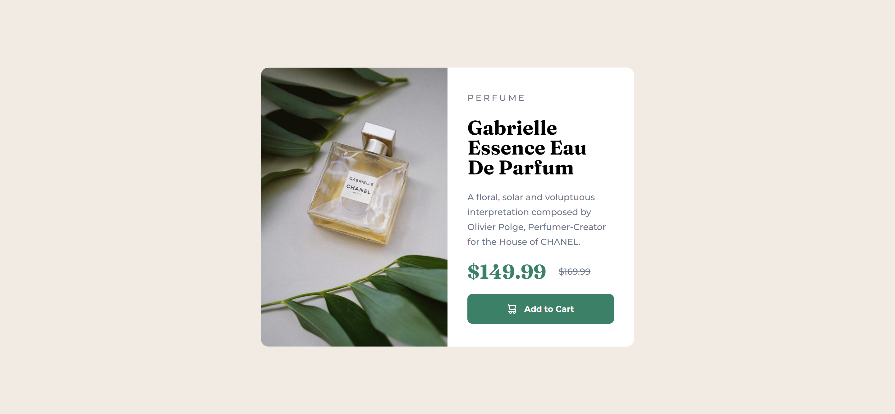
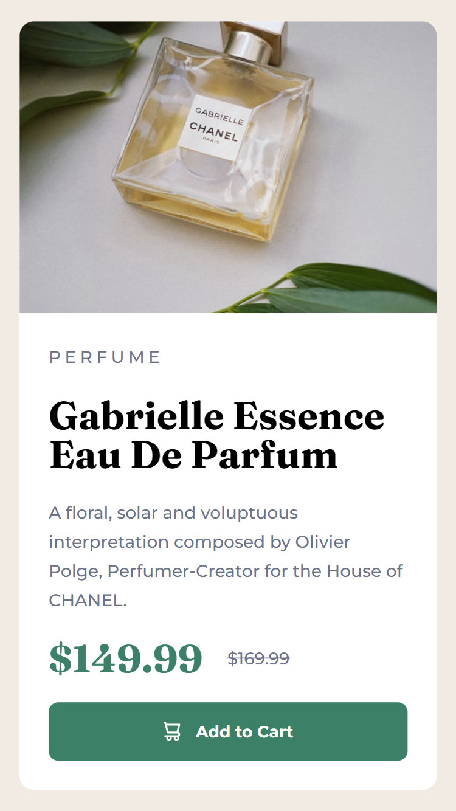

# Frontend Mentor - Product preview card component solution

This is a solution to the [Product preview card component challenge on Frontend Mentor](https://www.frontendmentor.io/challenges/product-preview-card-component-GO7UmttRfa). Frontend Mentor challenges help you improve your coding skills by building realistic projects. 

## Table of contents

- [Overview](#overview)
  - [The challenge](#the-challenge)
  - [Screenshot](#screenshot)
  - [Links](#links)
- [My process](#my-process)
  - [Built with](#built-with)
  - [What I learned](#what-i-learned)
  - [Continued development](#continued-development)
  - [Useful resources](#useful-resources)
- [Author](#author)

## Overview

### The challenge

Users should be able to:

- View the optimal layout depending on their device's screen size
- See hover and focus states for interactive elements

### Screenshot

 


### Links

- Solution URL: [GitHub](https://github.com/RommelIvan/product-preview-card-component-challenge)
- Live Site URL: [GitHub Pages](https://RommelIvan.github.io/product-preview-card-component-challenge/)

## My process

### Built with

- Semantic HTML5 markup
- Flexbox
- Mobile-first workflow

### What I learned

In order to switch between different screen sizes, I learned how to use media queries. I also learned how to use the CSS property `content`, which I used to change the original image source from `image-product-mobile.png` to `image-product-desktop.png.`
```css
@media only screen and (min-width: 600px) {
  .perfume-image {
    content: url("images/image-product-desktop.jpg");
  }
}
```

### Continued development

The ability to flip between mobile and desktop screens or any other screen sizes makes media queries highly valuable for users and developers, therefore I plan to utilize them more in the future.

### Useful resources

- [Interneting Is Hard](https://www.internetingishard.com/html-and-css/) - A Friendly Web Development Tutorial for Complete Beginners, Helped me on learning the basics of Frontend Development.

## Author

- Website - [Add your name here](https://www.your-site.com)
- Frontend Mentor - [@yourusername](https://www.frontendmentor.io/profile/yourusername)
